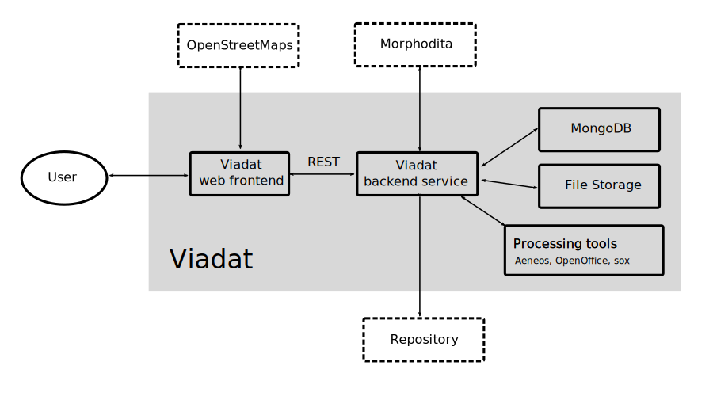

# Architecture of VIADAT

Viadat is composed of the following components:

- *Backend service* -- A main component that provides REST API for web front,
communications with database and manages uploaded files. It also implements
document processing features

- *Web frontend* -- A React application that provides user interface for viadat
  features. It communicates with backend service via REST API and with
  OpenStreetMaps.

- *MongoDB* -- Database that stores the state of the application (users,
  entries, labels) except data files (uploaded files and annotated transcripts).

- *File storage* -- Storage for data files.

- *Processing tools* -- Viadat utilizies several external tools in processing
  documents:
  - Aeneas for forced alignment
  - LibreOffice for converting document formats
  - sox for audio manipulation

Viadat also communicates with external services:

- *Morphodita* -- http://ufal.mff.cuni.cz/morphodita UFAL service for
  morphological analysis

- *Repository* -- 

- *OpenStreetMaps* -- OpenStreetMap for displaying geographic information to users

## Database structure

The following figure shows the main entities occuring in Viadat:

- *Entry* -- A top-level entity that may contains source data files and
  annotated transcripts

- *Source* -- A primary sources that are upload by user and is stored untouched
  within the system. Each Source may one or more files.

- *Transcript* -- A transcript managed by viadat. It is generated from Source
files. They are may be enriched by information from force alignment

- *Label category* -- 

- *Label* --

- *Label instance* --

## Source code structure
