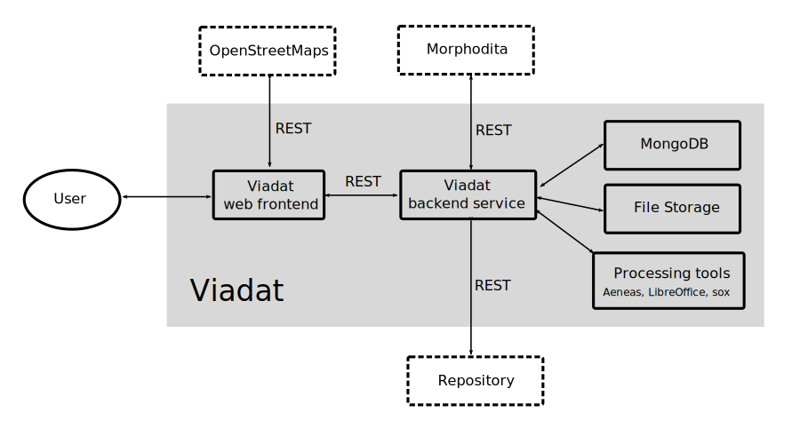

# Architecture of VIADAT

Viadat is composed of the following components:

- *Backend service* -- A main component that provides REST API for web front,
communications with database and manages uploaded files. It also implements
document processing features

- *Web frontend* -- A React application that provides user interface for viadat
  features. It communicates with backend service via REST API and with
  OpenStreetMaps.

- *MongoDB* -- Database that stores the state of the application (users,
  entries, labels) except data files (uploaded files and annotated transcripts).

- *File storage* -- Storage for data files.

- *Processing tools* -- Viadat utilizies several external tools in processing
  documents:
    * Aeneas for forced alignment
    * LibreOffice for converting document formats
    * sox for audio manipulation

Viadat also communicates with external services:

- *Morphodita* -- http://ufal.mff.cuni.cz/morphodita UFAL service for
  morphological analysis

- *Repository* --

- *OpenStreetMaps* -- OpenStreetMap for displaying geographic information to users

## Database structure

The following figure shows the main entities occuring in Viadat:

- *Entry* -- A top-level entity that may contains source data files and
  annotated transcripts

- *Source* -- A primary sources that are upload by user and is stored untouched
  within the system. Each Source may one or more files.

- *Transcript* -- A transcript managed by Viadat. It is generated from Source
  files. They are may be enriched by information from force alignment and may
  contains label instances.

- *Label category* -- Labels are organized into categories that formes a tree structure.
  A label category is a node in this tree. A category may contains another categories or labels.

- *Label* -- Labels are entities that are used for anotating transcripts.
  Usually, it represents a persons, disciplnes, places, and historical events.
  Label have name and may be connected with geographical point or set aliases.

- *Label instance* --
  Label instance is actual occurence of label in transcript.

## Source code structure

- *backend/* -- Python backend service

- *backend/audio* -- Processing audio files

- *backend/text* -- Processing text documents

- *web/* -- React frontend

- *tests/* -- Python tests

- *docs/* -- Documentation

- *files/* -- Default location where to store files

- *tools/* -- Helpler utilities

## Phases of creation of Transcript from Source

- Original document (.docx)
- Coversion to .odt [soffice]
- Extraction to transcript (xml) [viadat code]
- Morphological analysis [morphodita], result saved into transcript
- Force-alignment [aeneas], results saved into transcript

