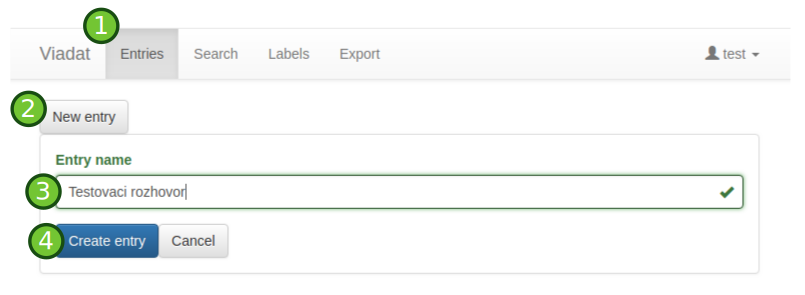
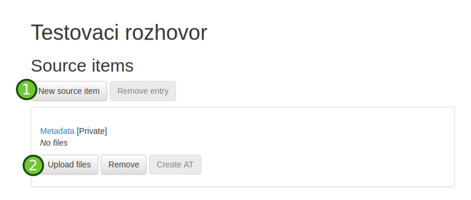
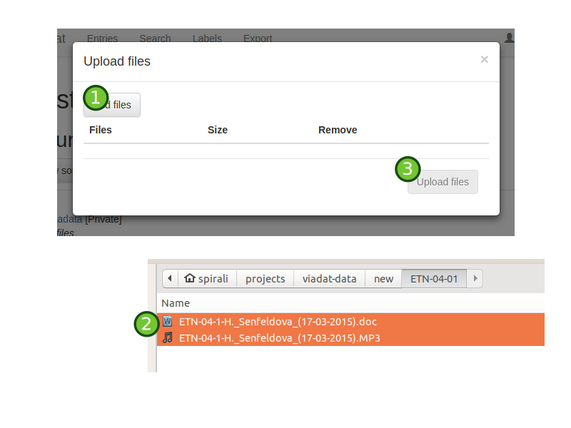
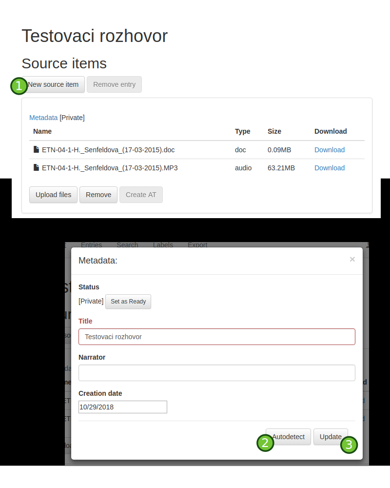
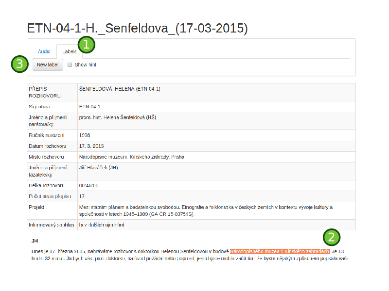

# Uploading new entry

First, we need to create new entry into Viadat:

Then we new "source" files into the system:

Uploading files into "source":

Autogenerating metadata from upload sources:

# Creating labels

